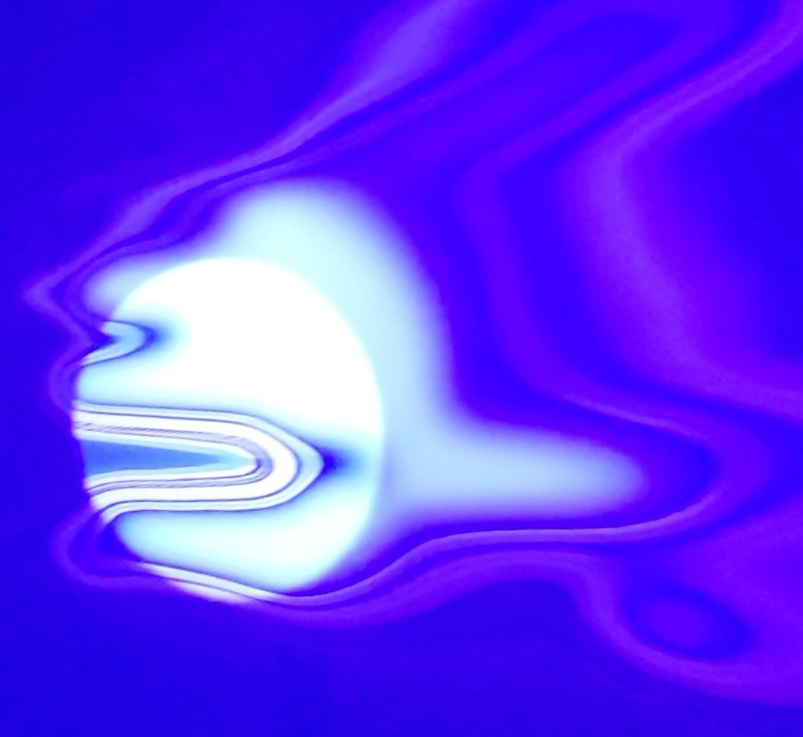

---
title: 'AURA/L'
date: 2023-06-02
draft: false
image: img/aural2.jpg
description: 'Art + Media Studio: Interactive and Immersive Art, 2023. AURA/L is a prototype of an audiovisual instrument you play with your physical presence. Upon entry into the 360-degree installation your body contributes an ever-changing soundscape that shifts both aurally and visually with your movement in the space.'
summary: 'A prototype of an audiovisual instrument you play with your physical presence.'
categories: ''
authors: ['Monika Hauck']
type: 'projects'
---

## An Interactive A/V Environ by Monika Hauck

AURA/L is a prototype of an audiovisual instrument you play with your physical presence. Upon entry into the 360-degree installation your body contributes an ever-changing soundscape that shifts both aurally and visually with your movement in the space. Each participant is assigned an individual sound that reacts to movement in the space as well as collisions with other interactive projections. Future iterations of the project will enable participants to interact with other participants as well as visual elements in the space to create a collaborative and generative audiovisual experience. 

<video controls width=100%>
  <source src ="./video/aural.mp4" type="video/mp4">
  Your browser does not support the video tag.
</video>

My goal for developing this work was to create an immersive environment wherein participants could loose themselves in a calm atmosphere and explore the impact of their physical presence in the space by playing with audio and visual cues that encourage subtle exploration and experimentation. The secondary intention of the project is to enable an interactive environment where music can be collaboratively composed without participants relying on any prior technical knowledge of playing an instrument. These two elements are being investigated in the context of AURA/L as a way to evaluate intuitive interactions of participants which will ultimately contribute to development of my thesis research topic. 

The concept of human auras refers to the subtle energy fields that surround the physical body and are believed to contain information about a person’s emotional, mental, and spiritual states. Capturing and visualizing these energy fields offers a glimpse into the invisible interactions of individuals as we enter each other’s orbits. With a greater awareness of these invisible forces, how might we approach carrying ourselves through public space with increased intention?

