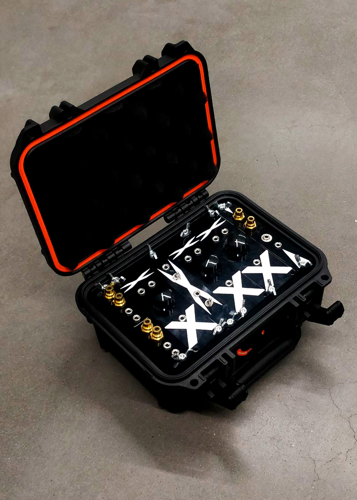
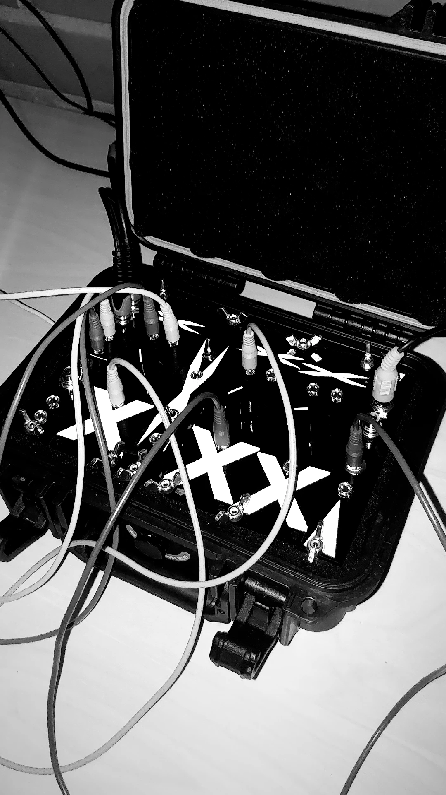

---
title: 'DVMMM'
date: 2023-06-02
draft: false
image: img/dvmmm_photo2.jpg
description: 'Art + Media Studio: Interactive and Immersive Art, 2023. DVMMM is an analog video mixer and glitch effect machine. The design is based on a well-known Karl Klomps ”dirty video mixer",  one of the most well-known and simplest DIY video glitch circuits. Glitch effects are made when two video signals fight for the signal space. This results in unexpected glitch effects.'
summary: 'DVMMM is an analog video mixer and glitch effect machine. The design is based on a well-known Karl Klomps ”dirty video mixer",  one of the most well-known and simplest DIY video glitch circuits. Glitch effects are made when two video signals fight for the signal space. This results in unexpected glitch effects.'
categories: ''
authors: ['Jassir Kuronen']
type: 'projects'
---



DVMMM is an analog video mixer and glitch effect machine. The design is based on a well-known Karl Klomps ”dirty video mixer",  one of the most well-known and simplest DIY video glitch circuits. Glitch effects are made when two video signals fight for the signal space. This results in unexpected glitch effects.

DVMMM was designed to follow similar principles as modern modular synthesizers, where through patching you could create new effects. As a project, DVMMM studies the performativity of analog video visualization as an instrument alongside existing digital tools. 

