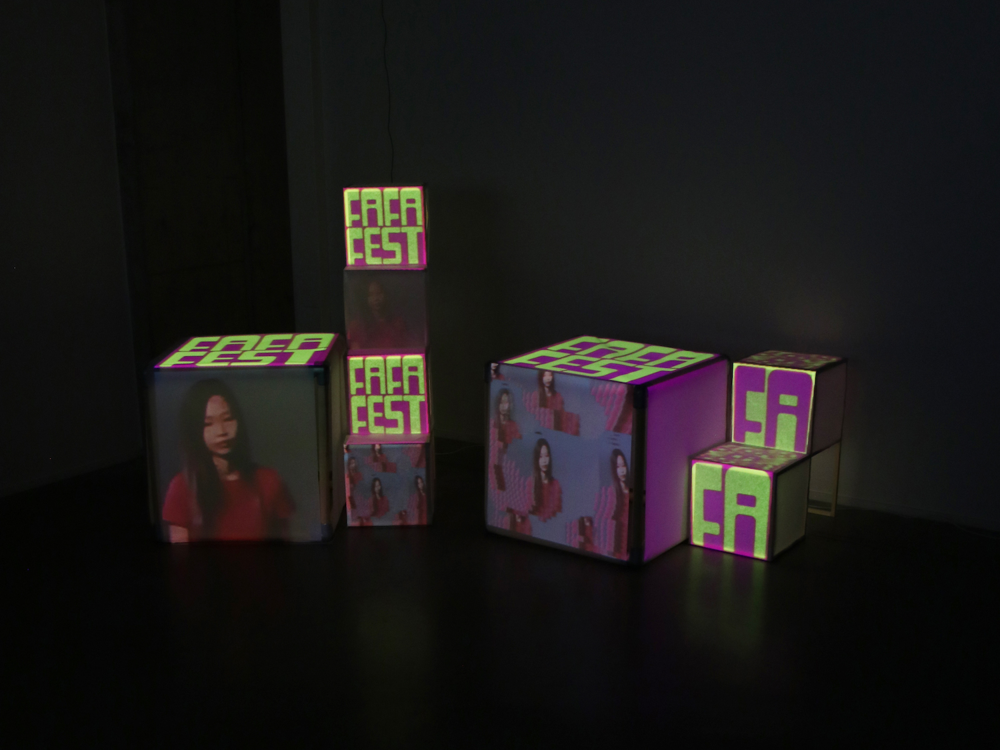
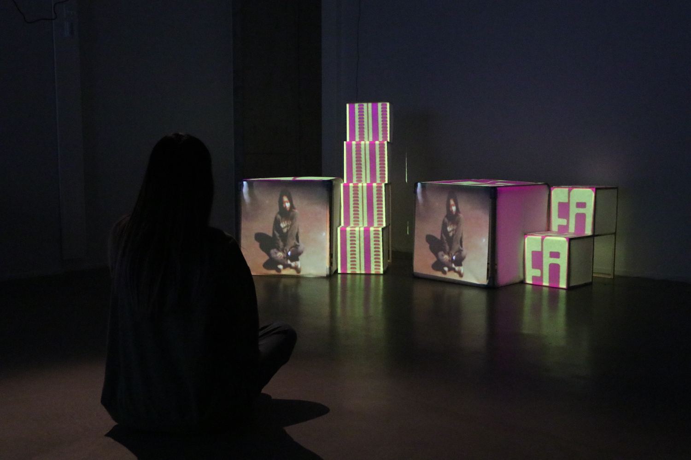
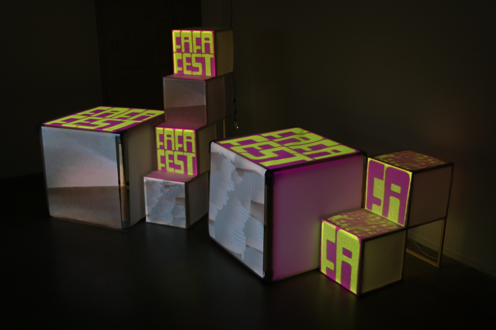

-**Date:** 2023.05-2023.06  
-**Material:** Wood, Diffusion Paper, Baking Paper  
-**Method:** TouchDesigner, Projection Mapping, Woodwork  
-**Participants:** Donato Renzulli (Visual Design), Yiting Ruan (Interior Architecture)

## Description

The project is an interactive and immersive art piece for FAFA Fest 2023, consisting of a visual identity and a captivating visual installation with projection mapping using cube structures. The installation features two cubes of different sizes to project diverse information. Through a creative blend of typography and 3D cubes, the visual identity embraces animations where the word "FA" takes on a graphic significance beyond its literal interpretation.  
  
The FAFA Fest is a music festival that will take place the 7th of July in Foggia, a city in the south of Italy. It is organized by young artists for a young audience, which is why we aimed to set a playful tone with the installation rather than an institutional one.  

<video controls width=100%>
  <source src ="./video/fafa_video.mp4" type="video/mp4">
  Your browser does not support the video tag.
</video>
  
The development of the visual identity for FAFA Fest required the creation of a visual language that could be versatile and flexible for digital content, printed content and live visuals on stage. As the tone of the festival was informal, playful and young, the creation of the visual identity started by experimenting with a 3D cube on whose faces the word FA appeared. A san-serif and non-institutional font was chosen that would convey well the mood of the project and that, applied as a 3D texture, would create a typographic pattern in which the meaning of the words gives way to their graphic value.  
  
From a technological point of view, working on this project was useful to explore how it is possible to create a dynamic, versatile yet recognisable visual identity. Priority is given to the creation of visual rules and manipulations, rather than the development of a static output with a precise form.  
  
In fact, the same manipulations applied to the texts and graphics were then applied to the images to present the artists and will be applied to the video inputs for the live visuals on stage. By creating a coordinated visual system, an attempt is made to involve the spectators more closely, making them more aware and included in the imagery of the festival by creating a connection between what is proposed in the digital content (social networks) and what is present in the physical space.  

  
In terms of its structure, the installation concept is based on the visual identity, utilizing cubes as the primary element for projection mapping. The varying sizes of the cubes enable the projection of diverse information. Additionally, the stacked arrangement of the cubes creates a sense of depth, while the distinct perspectives offered by their different sides enhance the interactive and immersive qualities of the 3D projection. This collaborative endeavor between spatial design and visual design seeks to amalgamate space, imagery, and new media.  
  
The cube, being a fundamental element in three-dimensional space, holds significant importance in the field of architecture due to its frequent implementation and consideration. The project drew inspiration from various architectural works and installations that effectively combine frames and surfaces. The primary objective was to construct a 1:1 scale space that visitors could physically enter, thereby facilitating a comprehensive sensory experience encompassing a 360-degree perspective. However, due to inherent spatial limitations, we made the decision to downscale the installation to a human-scale space, conveniently situated within a corner of the room. This adaptation enables users to engage with and manipulate the device, thereby fostering tactile interaction. Moreover, the consideration of cube size was influenced by the application of ergonomic principles in furniture design, thus potentially allowing for the device's future practical use as a table, seat, shelf, or similar functional apparatus.  

  
Following extensive experimentation on material workability and projection effects, our team concluded that diffusion paper and baking paper were the optimal choices. These materials offer ease of handling, while delivering excellent projection sharpness and clarity. Notably, both diffusion paper and baking paper possess desirable translucency, allowing for layering to attain varying degrees of clarity, as well as the creation of transparent and translucent visual effects.  
  
The technical implementation of the projection mapping system involved the construction of a TouchDesigner network, wherein individual outputs were assigned to control each of the 14 faces. This configuration facilitated the seamless transition between diverse visual elements and provided the ability to selectively conceal or reveal specific faces in response to music input or manual manipulation using a MIDI controller. The utilization of KatanMapper, a specialized software tool, played a pivotal role in generating the projection output required for the installation.  
  
In conclusion, the project is an interdisciplinary collaboration between visual design and spatial design. The outcome manifests as an interactive projection installation tailored for a youth-centric music festival, seamlessly integrating visual communication, digital image animation, and a physically immersive human-scale space. By merging these diverse elements, the installation aims to captivate and engage the festival's young audience, offering a multifaceted sensory experience that transcends traditional artistic boundaries.

