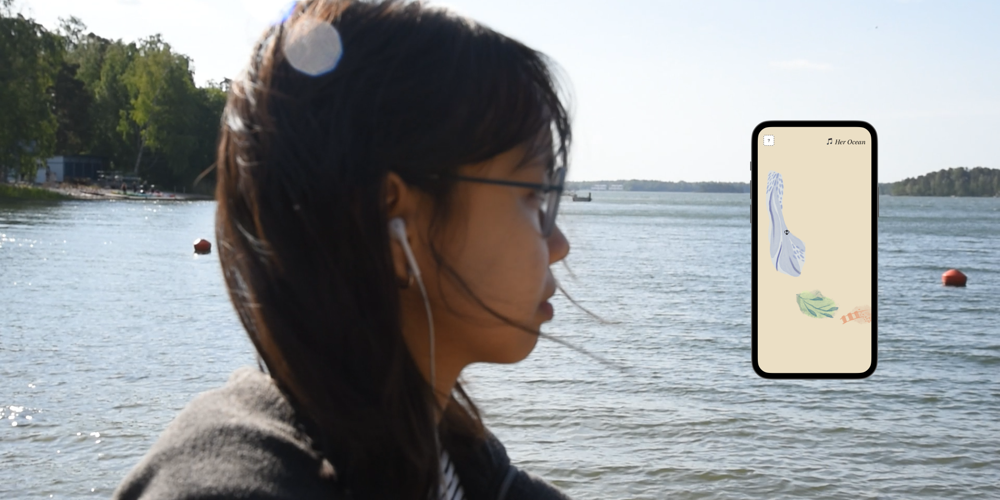
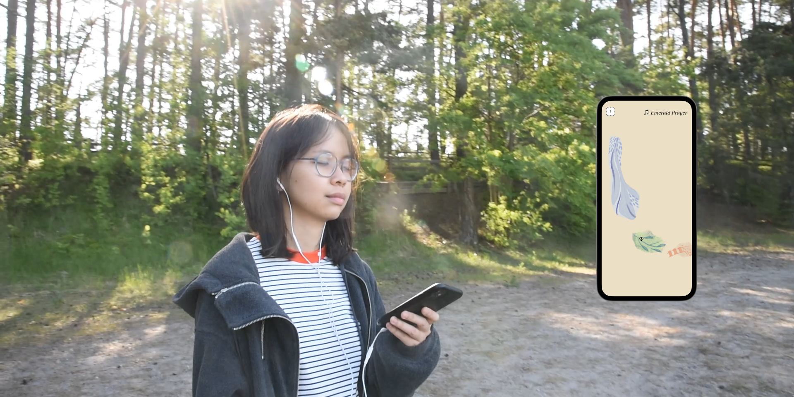

---
title: 'HearHere'
subheading: "A nature-based sound map of Kallahti"
date: 2023-06-16
draft: false
image: img/hearhere2.png
description: "Art + Media Studio: Interactive and Immersive Art, 2023. The project embodies an intricate intertwining of sound, nature, and geospatial web technology. It is an exploration of the profound yet subtle impact of nature's symphony on our emotional and physical well-being, a deep dive into the sonic narrative of our world."
summary: "The project embodies an intricate intertwining of sound, nature, and geospatial web technology. It is an exploration of the profound yet subtle impact of nature's symphony on our emotional and physical well-being, a deep dive into the sonic narrative of our world."
categories: ''
authors: ['Yan Zhang', 'Anh Ngo']
type: 'projects'
---



- **Authors:** Yan Zhang & Anh Ngo
- **Project:** HearHere: Nature-based sound map - [Link to the web app](https://thunderous-licorice-a48cad.netlify.app/)
- **Location:** [Kallahti beach, Helsinki](https://goo.gl/maps/U7dbNAvkLLmTQ1hD8)
- **Sound tools:** Hardware: Zoom H5 recorder, Contact Microphone, Modx 7; Software: Ableton, MusicScore, AnthemScore
- **Map tools:** p5.geolocation.js, Javascript, Felt, Google Maps
- **GitHub:** https://github.com/anh-ngo/sound-map

Our project, *HearHere: A Nature-Based Sound Map of Kallahti*, embodies an intricate intertwining of sound, nature, and geospatial web technology. It is an exploration of the profound yet subtle impact of nature's symphony on our emotional and physical well-being, a deep dive into the sonic narrative of our world. This undertaking takes inspiration from the harmony between music and nature, acknowledging their shared capacity to stimulate feelings, memories, and connections to places and stories.

The creative process unfolded iteratively; it began with an immersive exploration of a natural landscape, then moved onto composing sounds that mirrored various locations within that landscape, and finally resulted in the design of a nature-based auditory experience. We aimed to move beyond simply mimicking the auditory environment; we sought to enhance it, weaving together melodic and poetic elements that enhance the listener's experience.

Every technique employed in this project – from field recording to poetry and sound composition – has been meticulously chosen and executed to create a rich and immersive sonic map. It is designed to invite the audience into a healing, narrative audio journey, where piano notes and poetry intermingle to craft a lingering resonance. To visually guide users through the journey, we employed the p5.geolocation.js library and geospatial data, transforming Kallahti's physical spaces into an imagined, sonic landscape within our web app. 

The roots of this project lie deep within our shared curiosity about the endless potential that lies at the intersection of the natural landscapes and sound. It's a harmonious convergence of our team's backgrounds, with one member drawing from a previous exploration into the therapeutic potential of music, while another experiments with geospatial web technologies to create an intimate link between physical and virtual spaces. These inspirations, merged with the ethereal beauty of Kallahti's landscapes, serve as the cornerstone for *HearHere*.

In conclusion, *HearHere: A Nature-Based Sound Map in Kallahti* is a nature-inspired sonic journey designed to foster a fresh perspective on our relationship with the natural world. It underscores the healing potential of its often-overlooked melodies, immersing listeners in an unfolding narrative - a collective celebration of nature and the transformative power of truly immersive listening.

