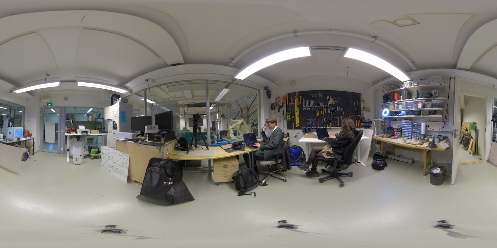

### Transcend the limitations of decision making with Artificial Intelligence. Optimize the search for ethical solutions to unlock your full potential.   

### *“The greatest challenge for humanity is solving the process of problem solving itself”.* 

<video controls width=100%>
  <source src ="./video/justify-ai.mp4" type="video/mp4">
  Your browser does not support the video tag.
</video>

Did you know that when a problem reaches a certain degree of complexity, our brains lose the capacity to keep track of all the variables?  While choosing the proper course of action for each given situation, we rely on emotion, bias and instinct more often than we consciously realize.  This is what makes choosing the right options in today’s hectic work environment a time-consuming process, that often comes at the cost of productivity. 

Justify.ai allows you to unleash your potential by streamlining the decision-making process. With just a few clicks it offers rational and ethical solutions that are always aligned with either your personal values or company policies, presented in a format that is grounded in psychological research. With Justify.ai’s immense pool of data, you can rest assured you are making better decisions than all of humanity combined. Focus on innovation instead of procrastination, and in the process, increase the wellbeing of your employees by eliminating cognitive dissonance. 

## Our Product

- **Easy to configure, fast to deploy**

Select what is important to you from a wide selection of values. Our system takes less than five minutes to set up and can be changed at any time. With our robust set of toggles, you can determine which values are personally selectable, and which are companywide. 

- **Trustworthy and reliable**

With our tool, you can be certain where it gets its ideas from. Our data is 100% verified to be from trustworthy academic sources, such as professional ethicists and philosophers. We use cutting-edge ELK (Eliciting Latent Knowledge) Technology to keep it aligned with your choices. 

- **Private and secure**

The system runs completely locally, meaning that your company secrets remain with you. The Justify.ai experience is built from the ground up to combine the benefits of personalization with the security of total anonymization.   

- **Gain smart insights**

Justify.ai provides smart, anonymous analytics of what topics are being addressed in your company and gives insights on employee satisfaction. Our tool helps you identify potential areas of friction more efficiently than ever before. 

## Our mission

The #1 tool for mitigating the effects of cognitive dissonance in the workplace 

The common perception is that humans use reasoning to solve complex issues. Scientists have discovered, however, that most decisions are made subconsciously, and reasoning enters the picture only after the fact when we need to justify our actions.  

When there is a disparity between an action we have committed and the mental models we have available to make sense of them, cognitive dissonance occurs. Cognitive dissonance registers in the anterior cingulate cortex, where the brain also processes sensations of pain. This is what makes it a stressful condition that, when prolonged, can lead to severe anxiety, mental fatigue, and decreased productivity. To reduce these effects in today’s hectic work environment, we present a solution: Justify.ai. 

By utilizing multidisciplinary research from the fields of human-computer interaction, cognitive psychology and machine learning, we at Justify.ai have developed a tool that is trained to mirror the cognitive behaviours our brains deploy when processing cognitive dissonance.  

When you pose a dilemma to Justify.ai, it is trained to present you these options that are scientifically proven to be the most effective: 

>Change the behavior or the cognition ("I'll stop offering these non-organically produced coffee beans in my cafeteria.") 
>
>Justify the behavior or the cognition, by changing the conflicting cognition ("It is impossible to monitor the entire supply chain of all of my products, so >offering these coffee beans is a reasonable compromise.") 
>
>Justify the behavior or the cognition by adding new behaviors or cognitions ("I'll spend less on coffee beans but will use what I save up for sourcing >organically produced oats for the porridge that we offer.") 
>
>Reorient your relationship with the information that conflicts with existing beliefs ("Can I truly trust the supplier of the organic alternative? Are >organic products important to the values of my cafeteria?” )

We at Justify.ai believe that you should be the driving force behind your actions. We want you to feel like you have left no stone unturned while resolving whatever issue you are facing and are presented with multiple options in a clear and concise manner. 
