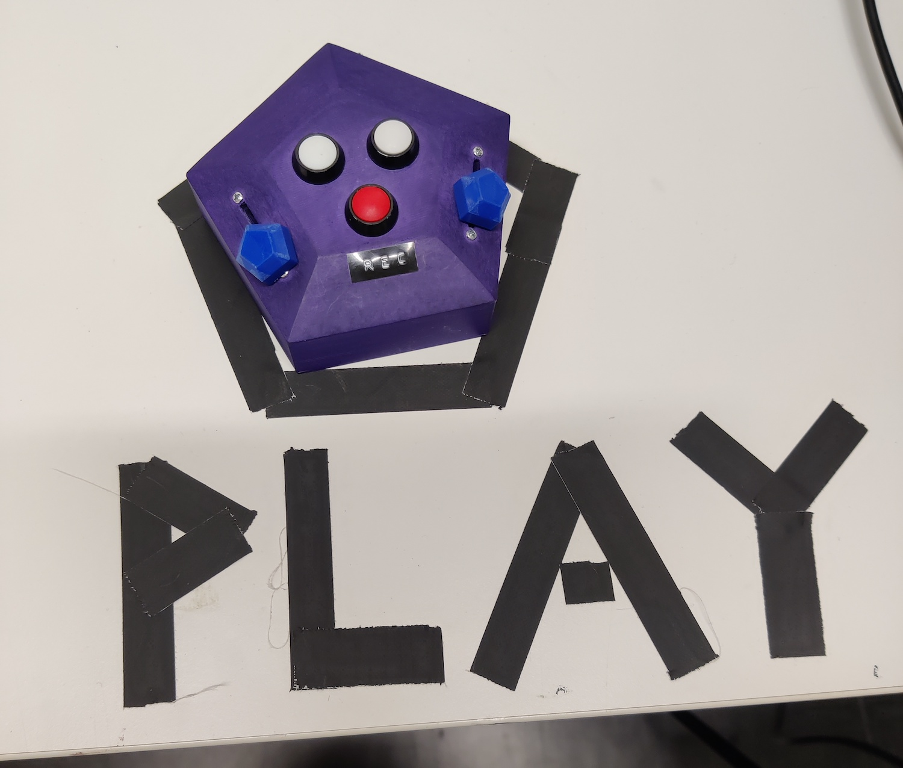

- **Author:** Katie Ballinger

Kaleido allows the participant to interact with a live view of themselves and their environment in a twisting, morphing, mirrored playground where they can explore shapes and colours by moving their body and interacting with a custom controller. The kaleidoscope is a children’s toy, and by bringing it to this medium, I invite people to engage with their childlike selves and discover the wonder lying in the duplicated spiraling patterns they create. A fluency comes from interacting with it and by learning the scope of its gaze and intricacies of its actions, people can choreograph movements and embed them into the installation to play long after they leave. The captured videos are projected onto the crystalized form, further distorting the captured images as they loop beside each other.

